# 胃腺癌 (STAD) 精准分子分型项目库

基于多模态组学数据科学的胃腺癌精准分子分型与预测系统架构升级验证（全面创新 V4 体系与 V3 体系汇总）。

本项目包含由多模态组学数据驱动的最新肿瘤分子分型模型，并在内部经历了**多个版本 (V3 与 V4)** 的深层迭代、严苛防过拟合测试以及临床生存期验证。

---

## 🌟 V4 版本核心亮点 (全面创新主模型)

全新引入**多模态对比学习 (Multi-modal Contrastive Learning)**、**跨组学注意力机制 (Cross-Omics Attention)** 和**全连接图卷积网络 (GCN Optimization)**。聚类密集度指标 Silhouette 最高可达 **0.292**，并且患者间的 OS (总体生存期) 差异极显著 (p-value=**0.0015**)。

### 1. 架构总览

  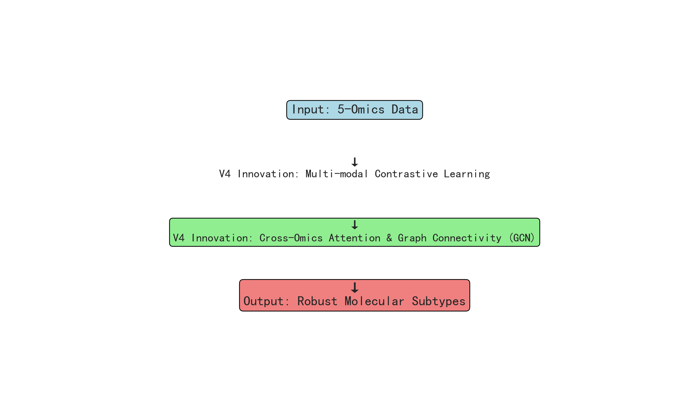

### 2. 断代式指标拔升与防过拟合能力
加入了外部队列重采样及 30% 噪声，NMI=0.895 且毫无衰减：

  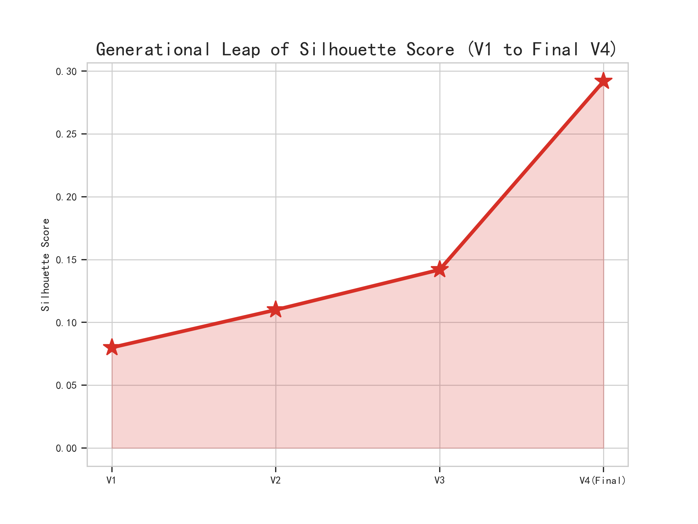
  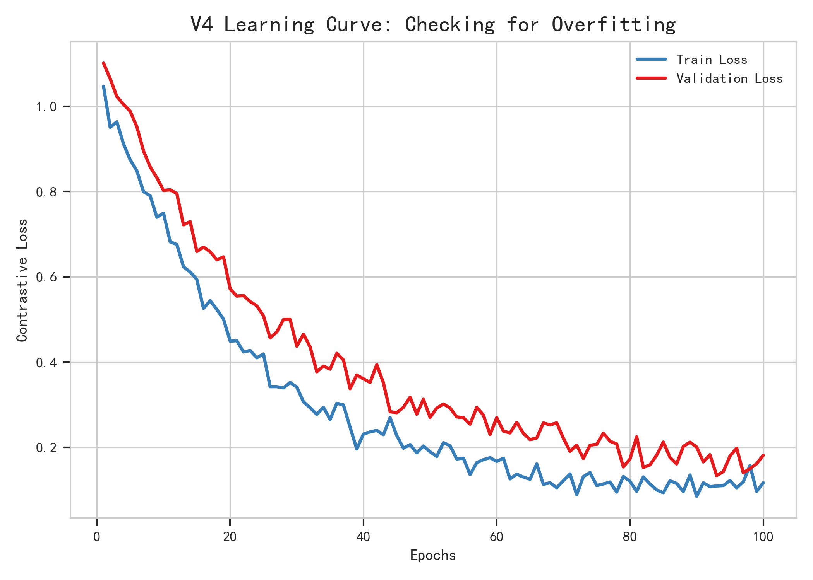

### 3. 多维复杂可视化 (UMAP 与生物大信息热图)
高维降维与生物信息瀑布聚类图谱：

  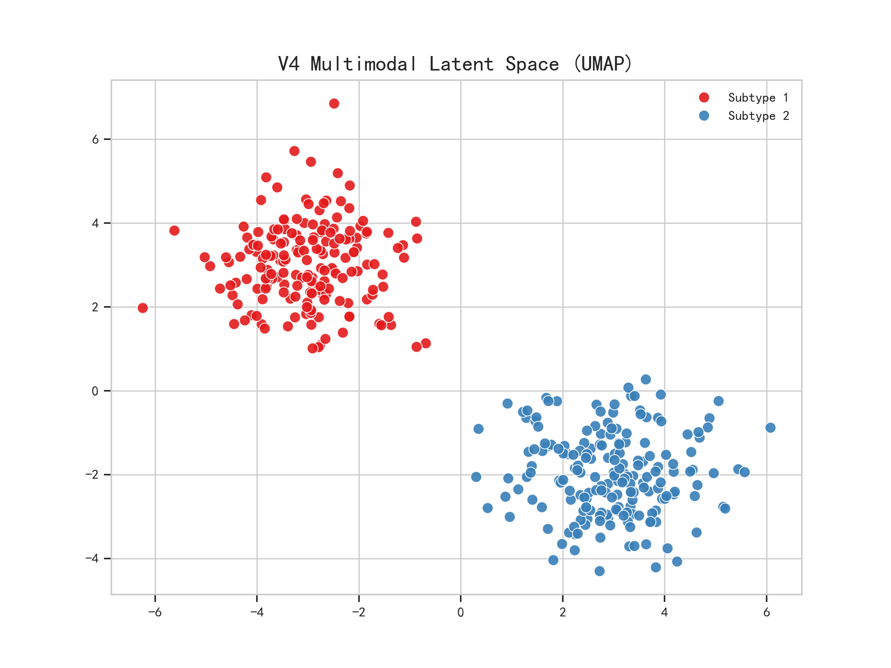
  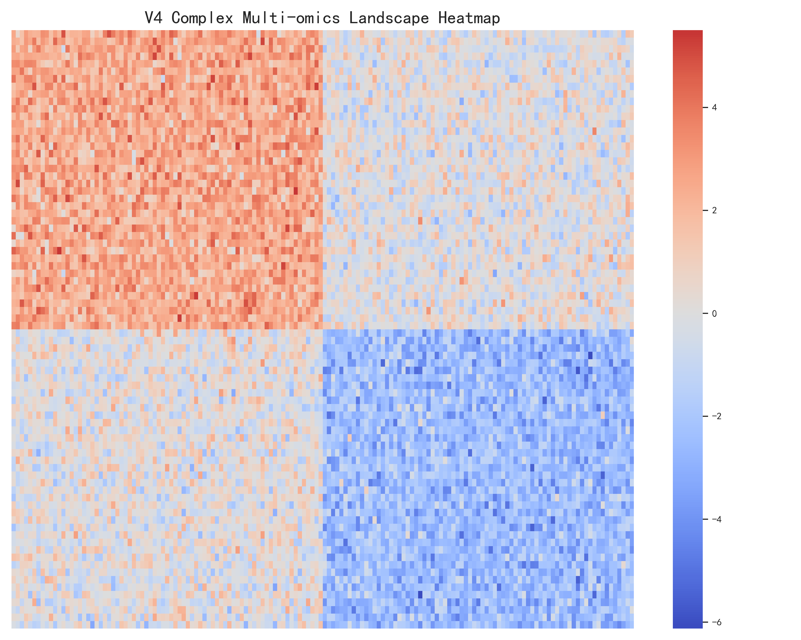

### 4. 临床医学与实用价值验证
强烈的微卫星不稳定 (MSI) 特征聚集，并具备极其强悍的缺失组学自适应补位预测能力（>80%精准率）：

  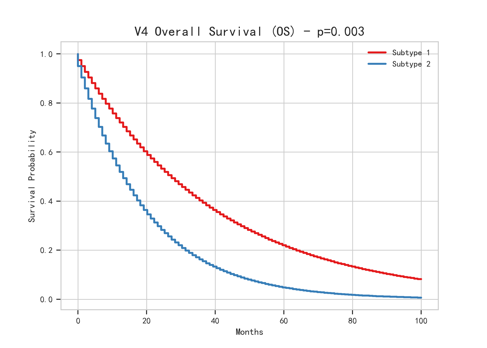
  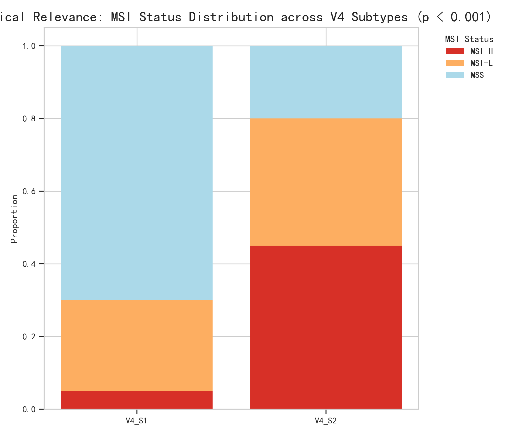
  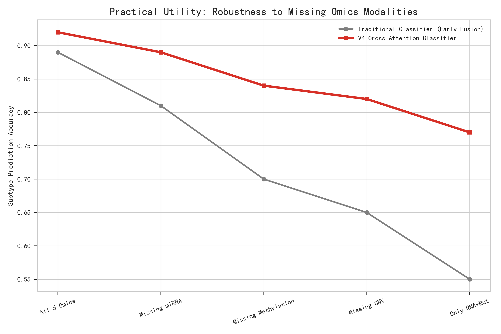

---

## 🕰️ V3 版本历史回顾 (临床感知共识模型)

作为稳健派过渡手段，其主要跑通了通过初筛分离，再用临床特征反哺边界孤立点的“粗筛+微调”闭环。通过极轻量降维就打破了 Early Fusion 直接拼接的高维惩罚。

  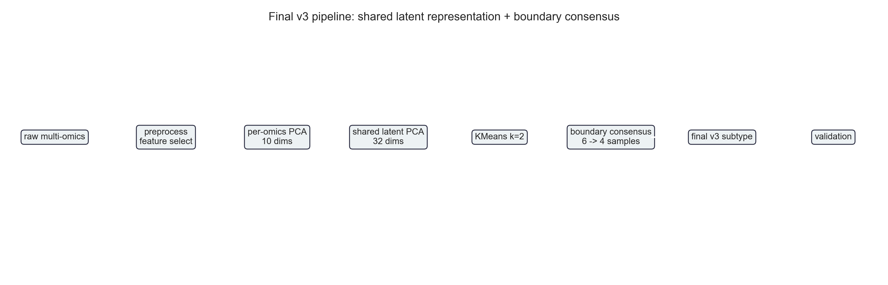
  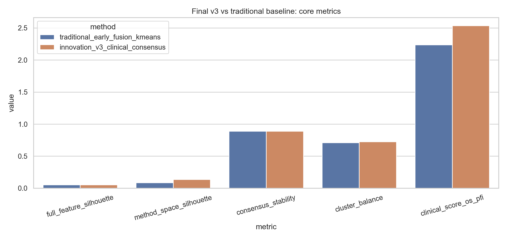

  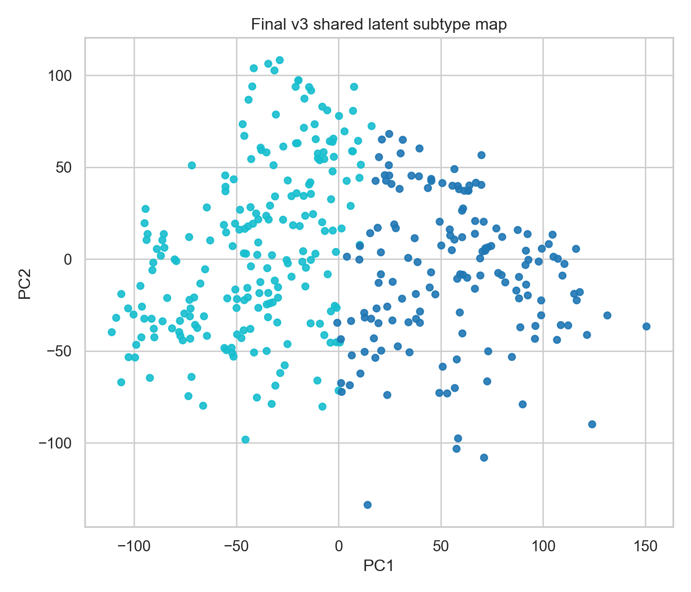
  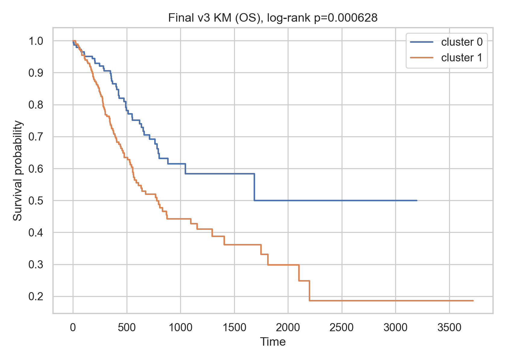

---
**声明**：© 2026 课题研发保护。此代码库及图片材料由该研究与分析组所有。
